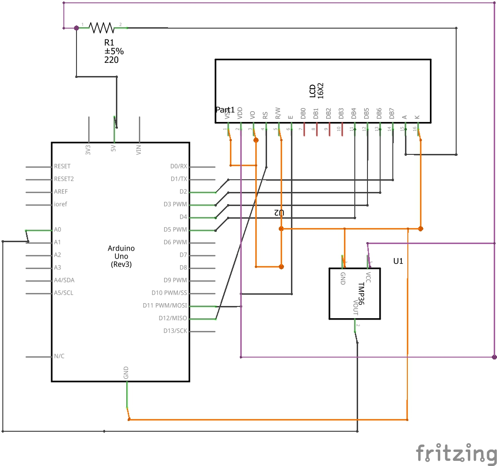

# Discover Arduino

A small Arduino project which shows current room temperature on an LCD screen.

Below you can find pictures of a finished board and a schema of the circuit.



## Used components

### 1. Sensor TMP36

The project uses a standard analogue TMP36 sensor to read the ambient temperature. The datasheet can be found here <https://bit.ly/2SacHcB>.

#### How to calculate the temperature

The sensor outputs a 10-bit analogue value ranging from 0 to 1023, which directly corresponds to a voltage. We can find the ratio of this correlation $r$ by dividing the analogue output by a number of possible analogue values, which in our case, is 1024. 

``` cpp
float ratio = tempSensorValue / 1024.0;
```
Having found the factor, we can now calculate a digital voltage output from the temperature sensor by multiplying our board's voltage, in this case, 5V, by the factor $r$. The final value is the correct one, however, we have to remember that the TMP36 sensor has a voltage offset of 0.5 volts, so we have to subtract 0.5V from our result.  

``` cpp
float voltage = ratio * 5.0 - 0.5;
```

Now, we can finally calculate the temperature. As we can read in the datasheet, the TMP36 sensor has a scale factor of 10mV/&#176;C (0.01V), so get the temperature, we have to divide our voltage by 0.01.

``` cpp
float roomTemperature = voltage / 0.01;
```
### 2. LCD Screen

The screen used can display up to 16 characters in each of the 2 available rows. The detailed, technical description can be found here <https://bit.ly/2vmdsHG>.

There are 16 pins available that receive distinct types of information, so to simplify the configuration of the screen, I used Liquid Crystal Library, which enables easy screen control without the need to go into low-level details.
